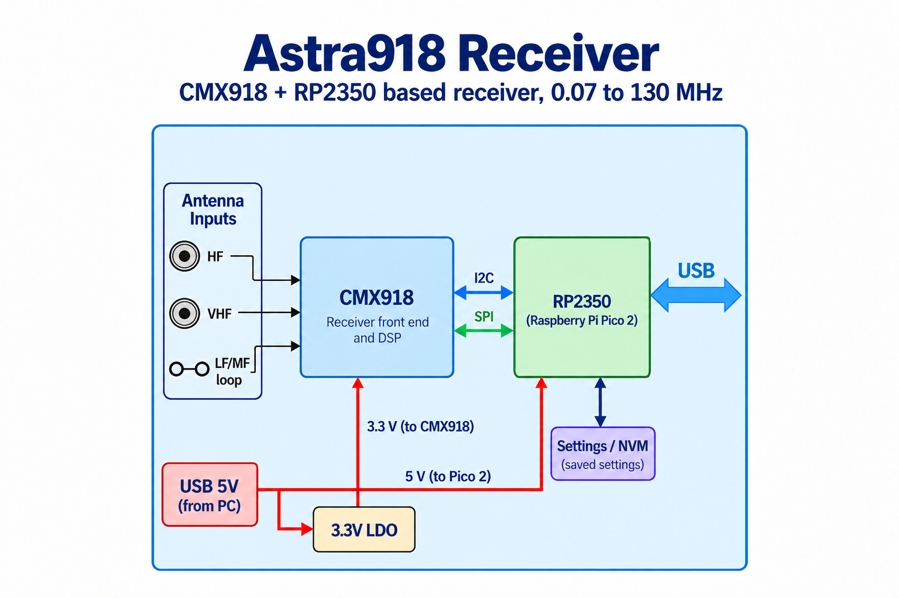

# Astra918

RP2350 receiver firmware combining CMX918 wideband I/Q with independent USB/LSB
audio for WSJT-X. One USB connection exposes a 12 kHz mono recording device,
a Kenwood-style CAT serial port, and 120 ksps signed 16-bit complex samples.
Use WSJT-X alongside either the SDR++ source or the Rust controller.

Hardware and software connections for the project are discussed in the
[EEVblog forum thread](https://www.eevblog.com/forum/rf-microwave/astra918-cmx918rp2350-based-receiver-0-07-to-130-mhz/).



Keep these independent repositories adjacent:

```
astra918sdr/          firmware, shared state/DSP, simulator, CLI
astra918sdr-gui/      Rust light-theme controls/status GUI
```

The RP2350A firmware and both Linux applications have been tested with the
physical receiver: on-air FT8, simultaneous SDR++/WSJT-X operation, bidirectional
tuning, controls, I/Q stall isolation, Save and incomplete-record recovery.
Native Windows/macOS hardware checks remain pending. No frequency-generator
tests are part of this project's acceptance procedure.

## Tuning

`firmware audio/CAT dial = spectrum center + firmware USB audio offset`, in Hz.
CAT tuning preserves offset and moves the spectrum. Example: dial 14,074,000
and offset +10,000 place the spectrum center at 14,064,000. CAT tuning to
7,074,000 moves that center to 7,064,000.

SDR++ Radio VFOs control local listening independently. Moving a VFO inside the
waterfall leaves firmware audio untouched. Moving the waterfall center retunes
the receiver and CAT dial while preserving the firmware audio offset. The GUI
exposes this same spectrum-center tuning. Both applications' audio offset controls
move the firmware channel and CAT dial inside the fixed RF spectrum using
command 38. The complete USB/LSB passband must remain within that spectrum.
The legacy command 33/CLI offset operation still preserves dial and moves center.

This center-based application update was compiled on Linux; runtime and hardware
tests were not rerun, as requested. Earlier hardware reports describe the
previous application tuning behavior.

The receiver is authoritative. Clients read its current state when connecting;
they never restore an old frequency automatically. The entire USB/LSB audio
passband must fit inside ±59.5 kHz. The 120 ksps spectrum has transition-band
roll-off near its edges; this is not a promise of a flat 120 kHz RF passband.
RF tuning limits are 70 kHz–130 MHz, subject to hardware qualification.

Startup without saved settings is 14.2 MHz, USB, zero offset, 100–3500 Hz audio,
AUTO input, RF/IF automatic gain. **Save to receiver** persists all current
settings, including dial and offset. Ordinary edits never write flash. Saving
briefly pauses reception; two alternating CRC-protected slots retain the older
valid configuration if a write is interrupted.

## Build and run without hardware

Install Rust/rustup, a C toolchain, Python 3 and CMake/Ninja. Rust 1.90.0 and
dependency versions are locked. The host library builds its vendored libusb.

```sh
cargo test --locked --workspace
cargo build --locked --release -p astra918-host
target/release/astra918-sim --cat-pty
# In another terminal:
target/release/astra918ctl --simulator 127.0.0.1:7350 status
cargo run --locked --manifest-path ../astra918sdr-gui/Cargo.toml -- --simulator 127.0.0.1:7350
```

On Windows omit `--cat-pty` and use `.exe` executables. The simulator listens
only on loopback: 7350 control, 7351 framed I/Q, 7352 CAT TCP, 7353 raw PCM16LE.
`--port N` moves all four ports together. It permits one vendor controller at a
time, just like the physical interface. Disconnect the GUI before connecting
SDR++; CAT and audio remain independent. `--settings DIR` isolates saved state.

```sh
# After building the C++ source/module as described in its README:
python3 scripts/test_offline.py
# Optional digital-mode tests, using an external WSJT-X v2.7.0 checkout:
python3 scripts/test_weak_signals.py --source /path/to/WSJTX
# Linux/PipeWire desktop, installed WSJT-X, isolated profile and virtual audio:
python3 scripts/live_wsjtx.py --mode FT8
# Or stop automatically after a decode and external-frequency readback:
python3 scripts/live_wsjtx.py --mode FT8 --verify
```

The weak-signal script needs gfortran, a C++ compiler, Boost headers, NumPy,
SciPy and installed WSJT-X `jt9`/`wsprd`. It builds upstream encoders only inside
ignored `artifacts/`; their licenses remain upstream. It tests USB and LSB
at ±45 kHz offsets through the production DSP. The live helper also supports
FT4 and WSPR. Close its isolated WSJT-X window to remove its temporary audio
nodes and child processes. It does not change normal WSJT-X configuration or
the default audio device. Its waterfall covers the generated 1500 Hz signal.

## Firmware images

Install `picotool` with its UF2 conversion command, then:

```sh
python3 scripts/build_firmware.py --variant rp235xa
python3 scripts/build_firmware.py --variant rp235xb
```

Each creates `artifacts/<variant>/astra918.{elf,uf2}` and a manifest recording
hashes, source revision and whether the tree was dirty. These commands only
build files. The board configuration assumes a 12 MHz MCU crystal and 4 MiB
flash, reserving the final 8 KiB for settings. Confirm the board variant,
flash capacity and inherited pinout before programming a different board.

Download tagged firmware from [GitHub Releases](https://github.com/ur8us/astra918sdr/releases):
`astra918-rp235xa.uf2` for RP2350A or `astra918-rp235xb.uf2` for RP2350B.
Pushing a `v*` tag builds and publishes both files. Other builds remain
available as a ZIP artifact of the **Firmware UF2** workflow in GitHub Actions.

## WSJT-X with the receiver

Select **Kenwood TS-480** or **Kenwood TS-570D**, its CDC serial port, 115200 baud, no handshake,
PTT VOX, Split None, Poll 1 s, and Mode None (preserves the firmware mode chosen
in the controller). Select Astra918 as recording input. Keep Enable Tx off:
this is a receive-only device. Select a band in WSJT-X normally.

Use the OS audio mixer/device so WSJT-X’s 48 kHz capture request is resampled
from the receiver’s 12 kHz UAC1 stream. On Linux use the PipeWire/PulseAudio
source, rather than an ALSA `hw:` device that cannot resample. This physical
path has been verified on Linux; native Windows/macOS checks remain pending.
CAT setters acknowledge successful
application; queries report applied settings, and external changes appear on
the next poll. `FW;` reports the current audio passband width for Hamlib.

Linux USB access uses [the supplied udev rule](packaging/70-astra918.rules).
Windows descriptors request WinUSB only for vendor interface 4; audio and CDC
retain their class drivers. If binding is needed, select **interface 4 only**.
macOS uses its audio/CDC drivers and libusb for vendor access. Do not reset the
whole USB configuration to connect a controller.

Implementation details: [protocol](docs/PROTOCOL.md), [provenance](docs/PROVENANCE.md),
[approved scope](docs/PLAN.md). Each host repository has its own build README.
